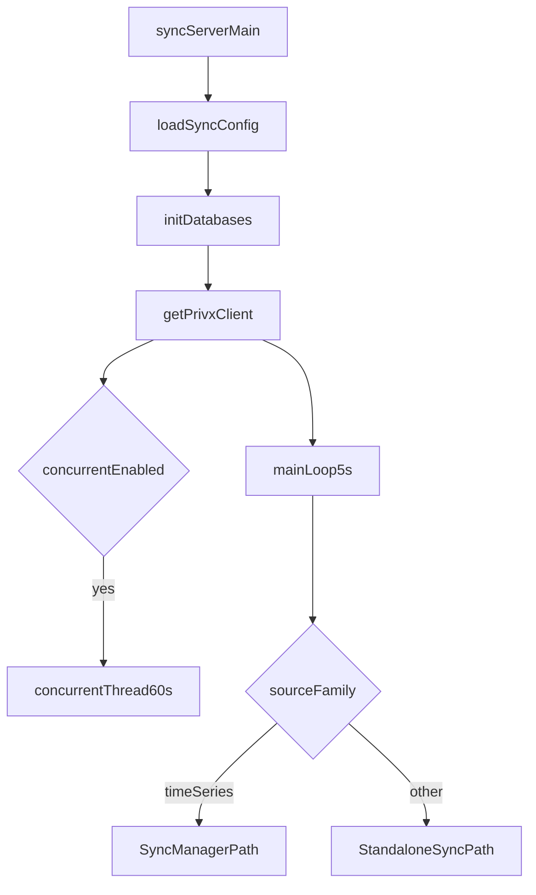

# Sync Server High-Level Architecture

This document explains the sync server flow at a high level, from startup to periodic source sync.

It focuses on developer orientation, not method-by-method internals.

## End-to-end flow

At runtime, sync server execution follows this path:

1. The user runs `bin/serve_sync` (or production wrapper scripts).
2. Entry point `sync_server/main.py` creates `SyncConfig` from environment.
3. Databases are initialized (`init_databases()`), and the PrivX API client is created.
4. A background thread is started for `concurrent` snapshots when enabled.
5. The main loop runs every 5 seconds and dispatches enabled sources.
6. Source-specific sync logic writes data into the data database.

## Two source families

The sync server has two distinct source families:

- **Time-series sources** (`audit`, `connection`)
  - Use shared `SyncManager` orchestration.
  - Use adaptive time windows and offset paging for high-volume data.
- **Other sources** (`trends`, `concurrent`)
  - Use standalone sync modules.
  - Use custom scheduling and data-shape logic.

**Note:** `concurrent` refers to the **source name for concurrent usage statistics** (active sessions and connections).

This split exists mainly for performance and operational safety: time-series sources may produce very large result sets and need adaptive batching logic.

## High-level topology

## Where to look in code

- `sync_server/main.py`: server startup, scheduling, and source dispatch.
- `lib/env_sync.py`: source names and runtime sync configuration.
- `lib/database/sync/time_series/`: time-series sync abstractions (`SyncManager`, protocol, windowing, sources).
- `lib/database/sync/trend.py`: daily trend sync path.
- `lib/database/sync/concurrent.py`: periodic concurrent stats sync path.

## Links

- Next: [Sync server bootstrapping](sync_server_bootstrapping.md)
- [Back to development guide](../DEVELOPMENT_GUIDE.md)
